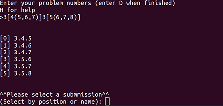

auto-hw :dizzy:
===============

**Are you ready for CSE 260 to suck a little less?**

You're in the right place. Auto-hw is an all-in-one template and submission
management solution designed to help you spend less time on the logistics of
homework and more time actually learning things.

Features
--------
* Batch homework template adaption
* Batch _.tex_ rendering

In Progress
-----------
* Automated Crowmark submission
* Improved error checking
* Batch package management
* [Let me know what you think would be helpful!](mailto:jarektroyer@gmail.com)

#### Assignment creation:

##### Batch homework template adaption generation:

Format:
~~~~
$chapter$[$section$($probnum$,$probnum$)]
~~~~

##### Individual homework template adaption:

Format:
~~~~
$chapter$.$section$.$probnum$
$chapter$.$section$.$probnum$
$chapter$.$section$.$probnum$
~~~~

##### Documentation

I don't have any formal documentation at this time, [but take a look at the code's comments!]()
